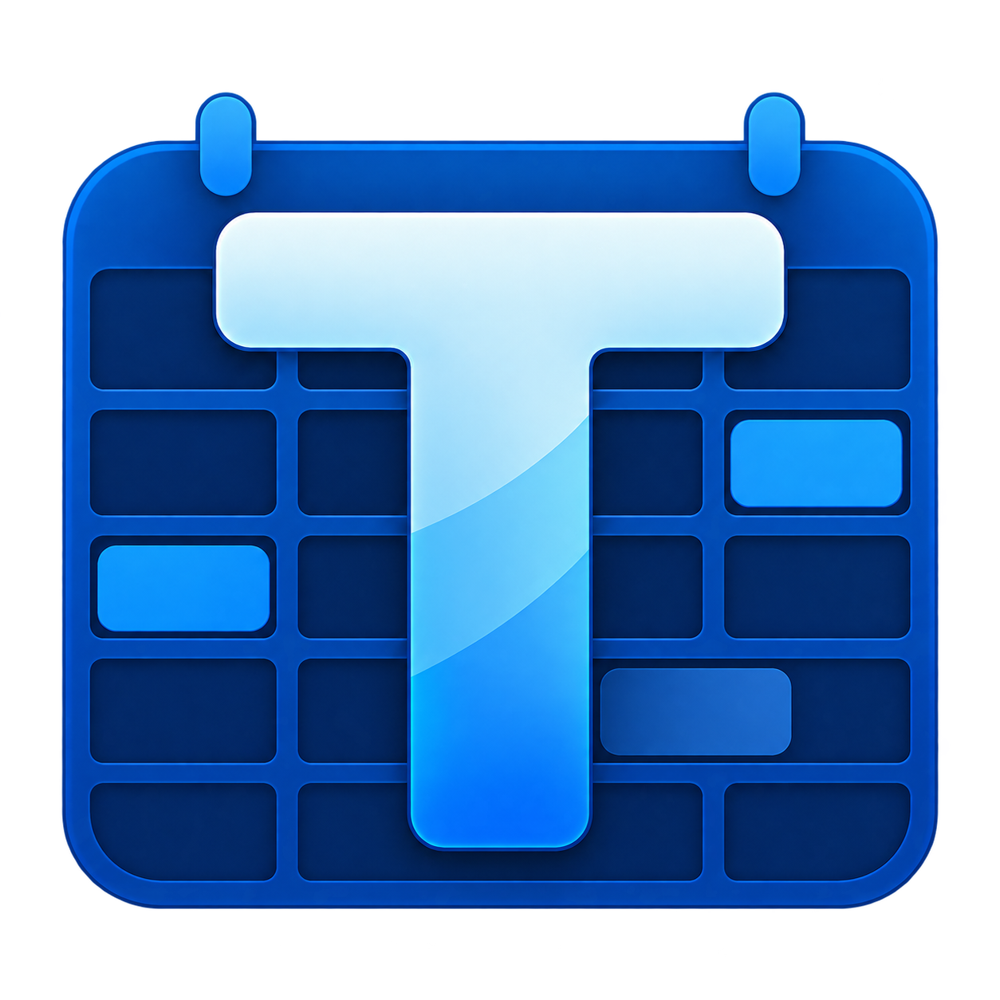
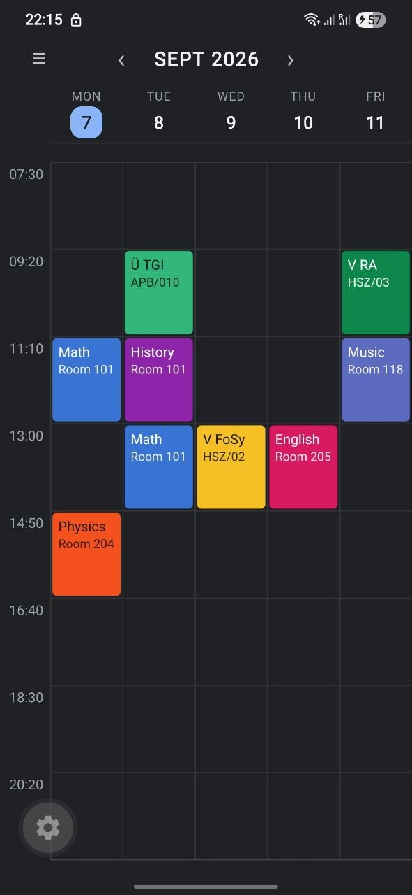
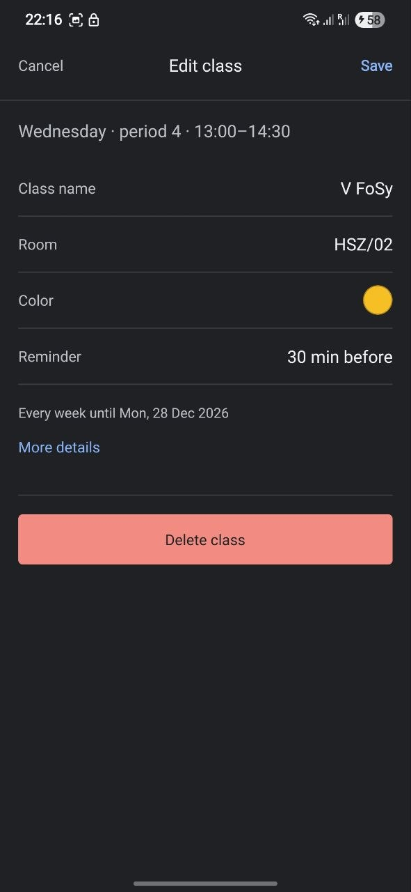
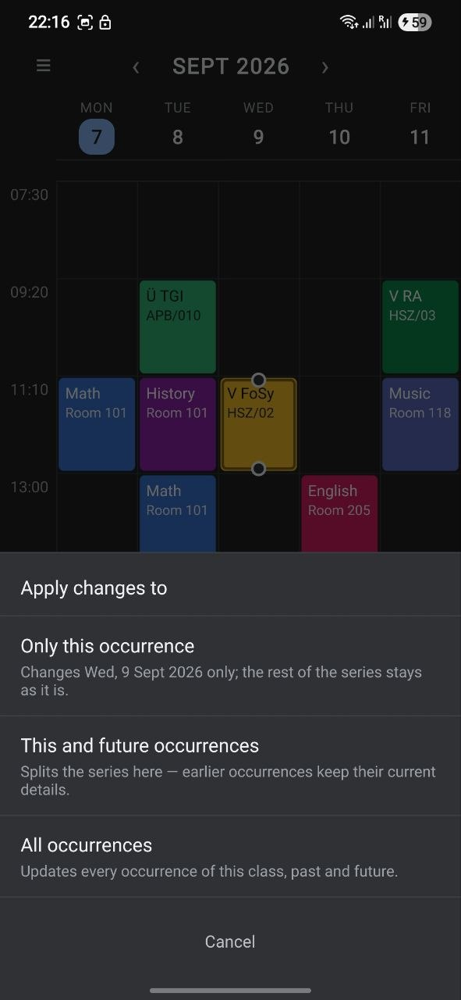

<p align="center">
  
</p>

<h1 align="center">Temelo</h1>

<p align="center">
  A local-first mobile timetable app for students.<br>
  <sub>Android · Expo / React Native · offline, no account</sub>
</p>

Temelo is a mobile-first, local-first timetable app for school and university
students.

Academic schedules are built from repeated lesson periods, so Temelo asks for
that structure once — start of the academic day, lesson length, break length,
number of periods — and then lets classes be placed into the resulting grid.
Creating a class is a tap on an empty slot, a name, and save; start and end
times never have to be typed again. Everything is stored on the device in
SQLite, and the app works with no account and no network connection.

The project started as a personal utility and is being developed into a
standalone mobile application and a portfolio piece.

## Current status

**Beta 1 (version 0.1.0).** Feature-complete for its first release: onboarding
and generated periods, the weekly timetable, SQLite persistence with versioned
migrations, recurring classes with occurrence-level exceptions, one active
timetable plus archived ones, local class reminders, `.temelo` backup and
transfer, one-way `.ics` calendar export, light/dark themes, and English,
Russian and German localization.

Android is the platform it is developed and tested on. It has **not** been
released to Google Play or the App Store, and there is no web version, cloud
sync, or account system. See
[docs/BETA1_RELEASE_NOTES.md](docs/BETA1_RELEASE_NOTES.md) for what Beta 1
contains and what it deliberately does not.

## Try Temelo Beta 1

Download **[Temelo-Beta-1.apk](https://github.com/ZhanibekAkhmetov/Temelo/releases/download/v0.1.0-beta.2/Temelo-Beta-1.apk)**

Release notes: [Temelo Beta 1](https://github.com/ZhanibekAkhmetov/Temelo/releases/tag/v0.1.0-beta.2)

To install it on an Android phone:

1. Download `Temelo-Beta-1.apk`.
2. Open the file. Android will ask whether to allow installing apps from whichever browser or files app you downloaded it with; allow it there, then continue.
3. Installing over an earlier Temelo build keeps your timetables.

This is a **test build distributed as a file, not a Play Store release**, which is why Android asks. It needs no account and no network connection. Uninstalling removes its data, so export a `.temelo` file first if you want to keep a timetable.


## Screenshots

A look at Temelo's timetable, class editing, and recurring scheduling.

| Dark theme | Light theme |
| --- | --- |
|  |  |

| Class editor | Recurring edits |
| --- | --- |
|  |  |

## Features

**Setup**

- Setup in two steps: the timetable's name and which days it has classes on,
  then the academic day (day start, lesson duration, break duration, number of
  periods). No start date, no end date, and no term to name — nothing in the
  app stops because of a date the user was asked to guess.
- Periods are generated from the academic-day configuration, with a live
  preview of the resulting day while the values are being chosen.
- The name, the days shown and the academic day can all be changed later from
  the timetable's own screen. Changing the academic day regenerates the periods
  and clears the timetable, which the app asks about first; editing an
  individual period's time is not implemented yet.

**Timetable**

- A weekly grid showing one dated week at a time, in either a vertical layout
  (days across, periods down) or a transposed horizontal layout, selectable in
  Settings.
- The vertical layout is a single Reanimated / Gesture Handler surface: week
  paging by swipe, vertical scrolling, pinch zoom of the time scale, and
  long-press move and resize of classes, all axis-locked and driven on the UI
  thread. The horizontal layout changes week with the header arrows, since its
  own horizontal scroll owns sideways gestures.
- Classes can span consecutive periods; placement stays period-aligned rather
  than free-form by design.

**Classes and recurrence**

- Quick creation: tap an empty slot, enter a name, save. Room, teacher, notes,
  colour, reminder and recurrence are optional and editable later.
- Weekly, every-two-weeks, and one-time recurrence. A repeating class is
  open-ended: it runs until it is changed or deleted, rather than until a date.
  Recurrence is still resolved lazily over the visible or reminder range, so
  "indefinitely" costs no stored records.
- Conflict checking resolves recurrence onto concrete dates, so two alternating
  biweekly classes can share the same weekday and period without being treated
  as a clash.
- Edits to a repeating class ask what they apply to: **Only this occurrence**,
  **This and future occurrences**, or **All occurrences** — implemented as
  per-occurrence exceptions and series splitting rather than duplicated
  records, so a later series-wide edit still reaches fields an occurrence did
  not deliberately override.
- Per-class colours from a fixed palette, editable with the same recurrence
  scopes as any other field.

**Reminders**

- Local notifications a configurable number of minutes before a class, with a
  default lead time for new classes and a per-class override.
- The schedule is recomputed from the persisted timetable and reconciled with
  what the OS already has, on a rolling two-week horizon, with a persisted
  ledger so a reminder is not delivered twice across restarts. Delivery is
  best-effort: these are ordinary local notifications, subject to permission
  and to the platform's own delivery behaviour.

**Sharing and backup**

- Any timetable — the current one or an archived one — exports to a `.temelo`
  file through the Android share sheet, so it can be sent by message, mail,
  Drive or Quick Share, or simply kept as a backup.
- The same **Share / Export** action also exports to a calendar: an `.ics` file
  for a date range you pick, which Google Calendar, Samsung Calendar, Apple
  Calendar and anything else standards-compliant can import. Every meeting in
  the range is written out individually — moved lessons at their new date,
  cancelled ones left out — so the calendar shows exactly what Temelo shows.
  It is a **one-time copy**: it does not update afterwards, Temelo never reads
  a calendar file back, and no calendar permission is asked for.
- Importing one is the reverse, and starts inside Temelo: pick the file, read a
  preview of what is in it, confirm. Nothing is written before that, so a file
  that is not a Temelo timetable changes nothing.
- An import is always a **new local copy** with fresh ids. Importing your own
  backup while the original is still on the device is safe, and so is importing
  the same file twice — you get two timetables, not a collision. Reminder lead
  times travel; reminder history and notification identity deliberately do not.
- The file carries the timetable and nothing else: not your appearance,
  language or default reminder, not reminder history, and no SQLite metadata.
- An import never displaces what you are using. With a timetable active it
  joins the archived ones; with none, it becomes the active timetable.

**Persistence and preferences**

- SQLite (`expo-sqlite`) as the source of truth, with ordered migrations keyed
  off `PRAGMA user_version`, WAL, foreign keys, and hydration gated before the
  first render.
- Appearance preference: system, light, or dark.
- Language: English, Russian or German, following the device's preferred
  languages by default, with a manual override.

Not yet implemented: picking an existing course when creating a second
placement, opening a `.temelo` from outside the app ("Open with Temelo"),
calendar *synchronization* (export is one-way and there is no `.ics` import),
and accounts.

## Technology

Versions are read from [package.json](package.json):

- Expo `~57.0.11` with Expo Router `~57.0.11` (file-based, typed routes)
- React Native `0.86.2`, React `19.2.3`, React Compiler enabled
- TypeScript `~6.0.3` in strict mode
- `expo-sqlite` `~57.0.2` for persistence
- `expo-file-system` `~57.0.7` for reading and writing `.temelo` and `.ics`
  files, and for its own native document picker
- `expo-sharing` `~57.0.19` for the Android share sheet
- `react-native-gesture-handler` `~2.32.0` and `react-native-reanimated`
  `4.5.1` for the timetable surface
- `expo-notifications` `~57.0.9` for class reminders
- `expo-localization` `~57.0.1` for device language detection
- `expo-dev-client` `~57.0.10`

The app runs from an Expo **development build**, not Expo Go: it depends on
native modules (SQLite, notifications, localization, Reanimated, Gesture
Handler) that Expo Go does not include.

## Architecture

Details are in [docs/ARCHITECTURE.md](docs/ARCHITECTURE.md); the short version:

- **Local-first.** Everything needed to use the app lives on the device. No
  backend is involved, and none is planned before the corresponding milestone.
- **SQLite behind a repository boundary.** Screens never touch storage; all
  reads and writes go through [src/storage/](src/storage/), which loads the
  whole timetable at boot and saves diffs in a single transaction, because one
  recurring edit can touch several records at once.
- **Versioned migrations.** Schema changes are appended as new migrations and
  never edited in place once shipped.
- **Domain logic is plain TypeScript.** [src/domain/](src/domain/) imports no
  React and no React Native primitives: courses, placements and occurrence
  exceptions, recurrence resolution onto real dates, conflict checking,
  edit-scope drafting, and reminder planning all live there.
- **Local time, not UTC.** Recurring lesson times are a local weekday plus
  `HH:mm`, never a UTC timestamp.
- **One active timetable, any number of archived ones.** The active timetable
  lives in the normalised working tables, so no read or write anywhere in the
  app had to learn about multiple timetables; an archived one is a single
  validated, versioned JSON snapshot, and archiving or restoring is one atomic
  swap between the two.
- **A file is another place to put a snapshot.** Export wraps the very same
  validated `TimetableSnapshot` an archive holds in a small versioned envelope;
  import validates it with the same validator a restore uses, and only then
  re-identifies every record. There is one definition of what a timetable is,
  not a second one for files.
- **Sync-ready records.** Device-generated string IDs plus
  `createdAt`/`updatedAt`/`deletedAt`, so a future sync layer has what it needs
  without a data migration.
- **Reminders are derived, not tracked.** The next fortnight's notifications
  are recomputed from the stored timetable and reconciled with the OS, so no
  bookkeeping can drift out of step with a move, a split series, a deletion, or
  a whole timetable being archived — only the active timetable is ever the
  input, so an archived one stops reminding without any code that knows what
  archiving is.

## Getting started

Prerequisites: Node.js and npm, plus an Android device or emulator. Developed
on Node 22; `npm run harness` in particular relies on Node's built-in SQLite
and TypeScript stripping, so it needs Node 22 or newer.

```bash
git clone <repository-url>
cd Temelo
npm ci
```

Temelo needs a development build to run. If you do not have one installed:

```bash
npm install -g eas-cli
eas login
eas build --profile development --platform android
```

Install the resulting build on the device, then start Metro:

```bash
npx expo start --dev-client
```

Open the app from the installed development build. The phone and the computer
must be able to reach each other on the same local network.

Ordinary JavaScript/TypeScript changes reload straight through Metro. Adding or
upgrading a native dependency, or changing native configuration in
[app.json](app.json), requires a **new development build** — an existing one
will not pick those up.

Checks:

```bash
npm run lint        # expo lint
npx tsc --noEmit    # TypeScript, strict
npm run harness     # domain + storage checks
```

`npm run harness` runs a small Node script under [harness/](harness/) that
exercises grid geometry and the storage layer against Node's built-in SQLite.
It is not a substitute for a real test runner, which has not been chosen yet.

## Android builds

Build profiles are defined in [eas.json](eas.json):

| Profile | Purpose |
| --- | --- |
| `development` | Development client — requires a running Metro server |
| `preview` | Internal distribution — a standalone installable **APK** |
| `production` | Store-oriented build (AAB), with remote version auto-increment |

```bash
eas build --profile development --platform android   # dev client
eas build --profile preview --platform android       # standalone APK
```

A development-client build is not usable on its own: it loads its JavaScript
from Metro. The `preview` profile is the one that produces a build a tester can
install and open without a development machine — it sets
`android.buildType: "apk"` explicitly, because the file attached to a GitHub
Release has to be something a phone can open, not an app bundle.

Versions: `app.json` holds the user-facing `version` (`versionName` on
Android). The Android `versionCode` is **not** in the repository —
`eas.json` sets `appVersionSource: "remote"`, so EAS keeps it, and both
`preview` and `production` auto-increment it. That is what makes each build
install over the last one.

## Roadmap

The full milestone history is in [docs/ROADMAP.md](docs/ROADMAP.md).

**Done** — onboarding and generated periods; the weekly grid with gestures,
pinch zoom and week paging; quick class creation and editing; weekly, biweekly
and one-time recurrence with edit scopes and occurrence exceptions; SQLite
persistence with migrations; the timetable lifecycle (one active timetable plus
archived ones); `.temelo` export, sharing and import; one-way `.ics` calendar
export over a chosen date range; local class reminders; themes; English,
Russian and German localization.

**Next** — Beta 1: a standalone offline Android release, its branding, and
acceptance on a physical device.

**Later, not committed to** — reusing an existing course across placements,
two-way calendar synchronization, a web version, optional account-based
synchronization, and possible store distribution.

## Repository structure

```
src/
  app/          Expo Router routes and layouts only
  components/   Reusable UI: fields, pickers, form sections, boot gate
  domain/       Pure TypeScript: recurrence, occurrences, conflicts,
                edit scopes, dates, reminder planning
  features/     Feature UI and logic: timetable surface, reminders,
                dev-only diagnostics
  i18n/         Translations (en/ru/de), locale detection, formatting
  state/        App state provider and defaults
  storage/      SQLite: database, schema, migrations, repository, and the
                file formats (`.temelo`, `.ics`)
  theme/        Design tokens, appearance preference, class colours
  types/        Shared model types
  util/         Native-module wrappers (notifications, haptics, files)
docs/           PRODUCT.md, ARCHITECTURE.md, ROADMAP.md,
                BETA1_RELEASE_NOTES.md
harness/        Node-based domain and storage checks
assets/         branding/ holds the Temelo mark and the icon, adaptive-icon,
                monochrome, notification and splash assets derived from it
```

## License

MIT — see [LICENSE](LICENSE).
